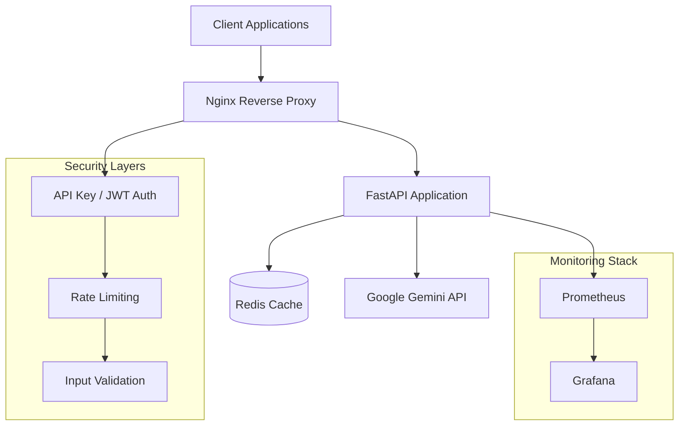

# Gemini API Server

A FastAPI-based server providing AI-powered chat and dictionary services using Google's Gemini API. Built with enterprise-grade security, scalability, and monitoring in mind.

## 📋 Table of Contents

- [Overview](#overview)
- [Architecture](#architecture)
- [Features](#features)
- [API Documentation](#api-documentation)
- [Installation & Setup](#installation--setup)
- [Configuration](#configuration)
- [Running the Application](#running-the-application)
- [Docker Deployment](#docker-deployment)
- [Testing](#testing)
- [Security](#security)
- [Monitoring](#monitoring)
- [Performance](#performance)
- [Troubleshooting](#troubleshooting)
- [Contributing](#contributing)
- [License](#license)

## 🎯 Overview

The Gemini API Server is a production-ready REST API service that provides:

- **AI Chat Service**: Character-based conversational AI using Google Gemini
- **Dictionary Service**: Intelligent English word lookup with educational level classification
- **Enterprise Security**: API key authentication, JWT tokens, rate limiting, and request deduplication
- **High Availability**: Docker-based deployment with load balancing and health checks
- **Observability**: Comprehensive logging, metrics, and monitoring

### Project Purpose

This server is designed for educational and enterprise applications requiring AI-powered conversation and dictionary services. It supports both development and production environments with robust security and scalability features.

## 🏗️ Architecture



### Core Components

- **FastAPI Application**: Modern Python web framework with automatic API documentation
- **Redis**: Caching and rate limiting storage
- **Nginx**: Reverse proxy with SSL termination and load balancing
- **Docker**: Containerized deployment with multi-stage builds
- **Google Gemini**: AI language model for chat and dictionary services

## ✨ Features

### Chat API (`POST /api/v1/chat`)
- Character-based AI conversations
- Support for up to 50 messages in conversation history
- Configurable character prompts
- Response confidence scoring
- Automatic content sanitization

### Dictionary API (`GET /api/v1/dictionary/{word}`)
- English word definitions with Korean translations
- Educational level classification (Elementary/Middle/High)
- Synonyms and antonyms
- Example sentences with translations
- Word suggestion and autocomplete
- Random word generation for learning

### Security Features
- API key and JWT token authentication
- Request rate limiting (configurable per minute)
- Concurrent request limiting (max 3 per user)
- Duplicate request detection (10-minute window)
- Input sanitization and validation
- CORS configuration
- Security headers

### Operational Features
- Health check endpoints
- Prometheus metrics export
- Structured JSON logging
- Request/response timing
- Error tracking and alerting
- Graceful shutdown handling

## 📚 API Documentation

### Authentication

All API endpoints (except health checks) require authentication via:

1. **API Key Header**: `X-API-Key: your-api-key`
2. **Bearer Token**: `Authorization: Bearer jwt-token`

### Endpoints

#### Chat Endpoints

**POST /api/v1/chat**
```json
{
  "character_prompt": "Be a helpful assistant",
  "messages": [
    {
      "user": "john_doe",
      "message": "Hello!",
      "sendDt": "2024-01-01T10:00:00"
    }
  ]
}
```

**Response:**
```json
{
  "success": true,
  "data": {
    "message": "Hello! How can I help you today?",
    "timestamp": "2024-01-01T10:00:01",
    "model_used": "gemini-pro",
    "confidence_score": 0.95
  }
}
```

**GET /api/v1/chat/models** - List available AI models

**POST /api/v1/chat/validate** - Validate chat request data

#### Dictionary Endpoints

**GET /api/v1/dictionary/{word}**
```json
{
  "success": true,
  "data": {
    "word": "apple",
    "meanings": ["사과", "애플 (회사명)"],
    "level": "초등",
    "synonyms": ["fruit"],
    "antonyms": [],
    "example_sentence": "I eat an apple every day.",
    "example_translation": "나는 매일 사과를 먹습니다.",
    "confidence_score": 0.95,
    "pronunciation": "/ˈæp.əl/",
    "part_of_speech": "noun"
  }
}
```

**GET /api/v1/dictionary/suggest/{prefix}** - Word autocomplete

**GET /api/v1/dictionary/random** - Random word for learning

#### Health Endpoints

**GET /api/v1/health** - Basic health check

**GET /api/v1/health/detailed** - Detailed system status

## 🚀 Installation & Setup

### Prerequisites

- Python 3.9 or higher
- Docker and Docker Compose
- Redis (for development without Docker)
- Google Gemini API key

### Local Development Setup

1. **Clone the repository**
   ```powershell
   git clone <repository-url>
   cd gemini-api-server
   ```

2. **Create environment file**
   ```powershell
   Copy-Item .env.example .env
   # Edit .env with your configuration
   ```

3. **Install Python dependencies**
   ```powershell
   pip install -r requirements.txt
   ```

4. **Run development server**
   ```powershell
   # Using Python directly
   uvicorn src.main:app --reload --host 0.0.0.0 --port 8000
   
   # Or using the development script
   .\scripts\start-dev.ps1
   ```

## ⚙️ Configuration

### Environment Variables

Create a `.env` file from `.env.example` and configure:

#### API Configuration
```env
API_HOST=0.0.0.0
API_PORT=8000
DEBUG=False
```

#### Security Settings
```env
SECRET_KEY=your-secret-key-change-in-production
API_KEY=your-api-key-for-authentication
JWT_SECRET_KEY=your-jwt-secret-key
JWT_ALGORITHM=HS256
JWT_EXPIRATION_HOURS=24
```

#### Google Gemini API
```env
GEMINI_API_KEY=your-gemini-api-key-here
GEMINI_MODEL=gemini-pro
```

#### Redis Configuration
```env
REDIS_URL=redis://localhost:6379/0
REDIS_PASSWORD=
```

#### Rate Limiting
```env
REQUESTS_PER_MINUTE=60
MAX_CONCURRENT_REQUESTS=3
DUPLICATE_REQUEST_WINDOW_MINUTES=10
```

#### CORS Settings
```env
ALLOWED_ORIGINS=http://localhost:3000,http://127.0.0.1:3000
ALLOWED_METHODS=GET,POST,PUT,DELETE,OPTIONS
ALLOWED_HEADERS=*
```

#### Logging
```env
LOG_LEVEL=INFO
LOG_FILE=logs/app.log
```

### Configuration Files

- `config/nginx.conf` - Nginx reverse proxy configuration
- `config/redis.conf` - Redis server configuration
- `pyproject.toml` - Python project configuration

## 🔧 Running the Application

### Development Mode

#### Using PowerShell Scripts (Recommended)
```powershell
# Start development environment with hot reload
.\scripts\start-dev.ps1

# Run tests
.\scripts\run-tests.ps1

# Run specific test types
.\scripts\run-tests.ps1 -Unit -Coverage
.\scripts\run-tests.ps1 -Integration -Verbose
```

#### Manual Setup
```powershell
# Start Redis
docker run -d -p 6379:6379 redis:alpine

# Run the application
uvicorn src.main:app --reload --host 0.0.0.0 --port 8000
```

### Production Mode

#### Using Docker Compose (Recommended)
```powershell
# Deploy production environment
.\scripts\deploy.ps1

# Deploy with monitoring
.\scripts\deploy.ps1 -Monitoring

# Update existing deployment
.\scripts\deploy.ps1 -UpdateOnly

# Rollback to previous version
.\scripts\deploy.ps1 -Rollback
```

#### Manual Docker Setup
```powershell
# Build and start services
docker-compose up -d --build

# View logs
docker-compose logs -f

# Stop services
docker-compose down
```

## 🐳 Docker Deployment

### Development Environment

```powershell
# Start development services
docker-compose -f docker-compose.dev.yml up -d

# Available services:
# - API Server: http://localhost:8000
# - Redis: localhost:6380
# - Hot reload enabled
```

### Production Environment

```powershell
# Start production services
docker-compose up -d

# Available services:
# - API Server: https://localhost (via Nginx)
# - Redis: Internal only
# - Nginx reverse proxy with SSL
```

### Production with Monitoring

```powershell
# Start with monitoring stack
docker-compose --profile monitoring up -d

# Additional services:
# - Prometheus: http://localhost:9090
# - Grafana: http://localhost:3000 (admin/admin)
```

### Scaling Services

```powershell
# Scale API servers
docker-compose up -d --scale api=3

# Check status
docker-compose ps
```

## 🧪 Testing

### Running Tests

The project includes comprehensive test coverage (90%+ target) with unit and integration tests.

#### Test Commands

```powershell
# Run all tests with coverage
.\scripts\run-tests.ps1 -Coverage

# Run only unit tests
.\scripts\run-tests.ps1 -Unit

# Run only integration tests
.\scripts\run-tests.ps1 -Integration

# Run tests with verbose output
.\scripts\run-tests.ps1 -Verbose

# Run specific test pattern
.\scripts\run-tests.ps1 -Pattern "test_chat"

# Watch mode for development
.\scripts\run-tests.ps1 -Watch
```

#### Manual Testing

```powershell
# Using Docker
docker-compose -f docker-compose.dev.yml run test

# Using Python directly (requires Redis)
pytest tests/ --cov=src --cov-report=html
```

### Test Structure

```
tests/
├── unit/              # Unit tests
│   ├── test_models.py
│   ├── test_security.py
│   └── test_services.py
├── integration/       # Integration tests
│   ├── test_api_endpoints.py
│   └── test_middleware.py
└── conftest.py       # Test configuration
```

### Test Coverage

The project maintains high test coverage:

- **Models**: 95%+ coverage
- **Services**: 90%+ coverage
- **API Endpoints**: 85%+ coverage
- **Middleware**: 85%+ coverage
- **Utilities**: 95%+ coverage

View coverage reports:
- Terminal: Coverage summary after running tests
- HTML: Open `htmlcov/index.html` after running with `--cov-report=html`

## 🔒 Security

### Authentication & Authorization

1. **API Key Authentication**
   - Header: `X-API-Key: your-api-key`
   - Used for service-to-service communication

2. **JWT Token Authentication**
   - Header: `Authorization: Bearer jwt-token`
   - Used for user sessions with expiration

### Security Measures

- **Input Validation**: Pydantic models with strict validation
- **Input Sanitization**: XSS prevention for text inputs
- **Rate Limiting**: Configurable per-client request limits
- **Request Deduplication**: Prevents duplicate processing
- **CORS Configuration**: Restricted cross-origin requests
- **Security Headers**: X-Frame-Options, CSP, etc.
- **SQL Injection Prevention**: Parameterized queries (if applicable)

### SSL/TLS Configuration

#### Development
```powershell
# Generate self-signed certificates
openssl req -x509 -newkey rsa:4096 -keyout config/ssl/key.pem -out config/ssl/cert.pem -days 365 -nodes -subj "/CN=localhost"
```

#### Production
Replace `config/ssl/cert.pem` and `config/ssl/key.pem` with valid certificates from a Certificate Authority.

### Security Best Practices

- Change default secrets in production
- Use strong, unique API keys
- Implement proper key rotation
- Monitor for suspicious activity
- Keep dependencies updated
- Use HTTPS in production
- Implement proper logging for security events

## 📊 Monitoring

### Metrics Collection

The application exports Prometheus metrics at `/metrics` endpoint:

- Request count and duration
- Error rates and types
- Redis connection status
- Memory and CPU usage
- Custom business metrics

### Health Checks

#### Basic Health Check
```
GET /api/v1/health
```

#### Detailed Health Check
```
GET /api/v1/health/detailed
```

#### Docker Health Checks
Containers include built-in health checks that Docker monitors automatically.

### Logging

#### Log Levels
- **DEBUG**: Detailed development information
- **INFO**: General application flow
- **WARNING**: Potentially harmful situations
- **ERROR**: Error events that don't stop the application
- **CRITICAL**: Serious errors that may abort the program

#### Log Locations
- **Application**: `logs/app.log` (rotating)
- **Nginx**: `logs/nginx/access.log`, `logs/nginx/error.log`
- **Console**: Real-time output during development

#### Log Format
```json
{
  "timestamp": "2024-01-01T10:00:00Z",
  "level": "INFO",
  "logger": "src.api.routes.chat",
  "message": "Chat request processed",
  "request_id": "abc123",
  "user_id": "user123",
  "duration_ms": 150
}
```

### Monitoring Dashboard

When deployed with monitoring enabled, access:

- **Prometheus**: http://localhost:9090
- **Grafana**: http://localhost:3000 (admin/admin)

Pre-configured dashboards include:
- API performance metrics
- Error rate tracking
- Redis performance
- System resource usage

## 🚀 Performance

### Optimization Features

- **Redis Caching**: Dictionary results and rate limiting data
- **Connection Pooling**: Efficient database connections
- **Async Processing**: Non-blocking I/O operations
- **Request Compression**: Gzip compression for responses
- **Static File Caching**: Long-term caching for static assets

### Performance Tuning

#### Application Settings
```env
API_WORKERS=4              # Number of worker processes
REQUESTS_PER_MINUTE=60     # Rate limiting threshold
MAX_CONCURRENT_REQUESTS=3  # Per-user concurrency limit
```

#### Redis Configuration
```
maxmemory 512mb
maxmemory-policy allkeys-lru
```

#### Nginx Configuration
```nginx
worker_processes auto;
keepalive_timeout 65;
gzip on;
```

### Load Testing

```powershell
# Install Apache Bench or similar tool
# Example load test
ab -n 1000 -c 10 -H "X-API-Key: your-key" http://localhost:8000/api/v1/health
```

### Scaling Strategies

1. **Horizontal Scaling**: Increase replica count
   ```powershell
   docker-compose up -d --scale api=5
   ```

2. **Database Scaling**: Use Redis Cluster for high availability

3. **CDN Integration**: Serve static content via CDN

4. **Caching**: Implement additional caching layers

## 🛠️ Troubleshooting

### Common Issues

#### 1. Application Won't Start

**Symptom**: Server fails to start or crashes immediately

**Solutions**:
```powershell
# Check environment variables
Get-Content .env

# Verify Redis connection
docker run --rm redis:alpine redis-cli -h host.docker.internal ping

# Check logs
docker-compose logs api
```

#### 2. Authentication Failures

**Symptom**: 401 Unauthorized errors

**Solutions**:
- Verify API key in `.env` matches request header
- Check JWT token expiration
- Ensure proper header format: `X-API-Key: value`

#### 3. Rate Limiting Issues

**Symptom**: 429 Too Many Requests errors

**Solutions**:
```powershell
# Check Redis connection
docker-compose exec redis redis-cli ping

# Review rate limit settings in .env
# Clear rate limit data (development only)
docker-compose exec redis redis-cli FLUSHDB
```

#### 4. Gemini API Errors

**Symptom**: Chat responses fail with 503 errors

**Solutions**:
- Verify `GEMINI_API_KEY` is correct
- Check Gemini API quota and billing
- Review application logs for specific error messages

#### 5. Docker Build Failures

**Symptom**: Docker image build fails

**Solutions**:
```powershell
# Clean Docker build cache
docker system prune -a

# Rebuild without cache
docker-compose build --no-cache

# Check Dockerfile syntax
```

### Debug Mode

Enable debug mode for detailed troubleshooting:

```env
DEBUG=True
LOG_LEVEL=DEBUG
```

### Log Analysis

```powershell
# View application logs
docker-compose logs -f api

# View all service logs
docker-compose logs -f

# Filter logs by level
docker-compose logs api | findstr ERROR

# Export logs for analysis
docker-compose logs --no-color > app.log
```

### Performance Debugging

```powershell
# Check container resource usage
docker stats

# Monitor Redis performance
docker-compose exec redis redis-cli --latency

# Check API response times
curl -w "@curl-format.txt" -H "X-API-Key: key" http://localhost:8000/api/v1/health
```

## 🤝 Contributing

### Development Workflow

1. **Fork the repository**
2. **Create a feature branch**
   ```powershell
   git checkout -b feature/amazing-feature
   ```

3. **Set up development environment**
   ```powershell
   .\scripts\start-dev.ps1
   ```

4. **Make your changes**
   - Follow code style guidelines
   - Add tests for new features
   - Update documentation

5. **Run tests and linting**
   ```powershell
   .\scripts\run-tests.ps1 -Coverage
   black src/ tests/
   isort src/ tests/
   flake8 src/ tests/
   mypy src/
   ```

6. **Commit your changes**
   ```powershell
   git add .
   git commit -m "Add amazing feature"
   ```

7. **Push and create Pull Request**
   ```powershell
   git push origin feature/amazing-feature
   ```

### Code Style

- **Python**: Follow PEP 8, use Black formatter
- **Type Hints**: Required for all functions
- **Docstrings**: Use Google style docstrings
- **Comments**: Explain complex business logic
- **Commit Messages**: Use conventional commit format

### Testing Requirements

- Maintain 90%+ test coverage
- Add unit tests for new functions
- Add integration tests for new endpoints
- Test error conditions and edge cases

## 📄 License

This project is licensed under the MIT License - see the [LICENSE](LICENSE) file for details.

## 🙏 Acknowledgments

- **FastAPI**: Modern web framework for building APIs
- **Google Gemini**: AI language model capabilities
- **Docker**: Containerization platform
- **Redis**: In-memory data structure store
- **Nginx**: High-performance web server
- **Prometheus & Grafana**: Monitoring and visualization

---

## 📞 Support

For support and questions:

1. **Check the documentation** above first
2. **Search existing issues** on GitHub
3. **Create a new issue** with detailed information
4. **Include logs and environment details**

## 🗺️ Roadmap

- [ ] Database integration for persistent storage
- [ ] WebSocket support for real-time chat
- [ ] Multi-language dictionary support
- [ ] AI model switching capabilities
- [ ] Advanced caching strategies
- [ ] Microservices architecture migration
- [ ] Kubernetes deployment manifests

---

**Built with ❤️ for developers who need reliable AI services.**